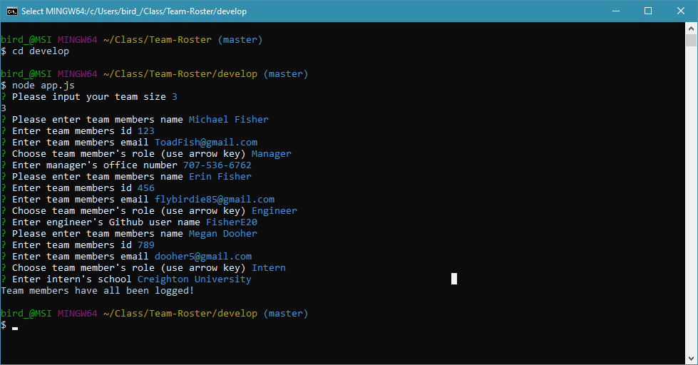

# Team-Roster



>An HTML displaying employees for a company

---

### Table of Contents

* [Description](#description)
* [How To Use](#how-to-use)
* [References](#references)
* [License](#license)
* [Author Info](#author-info)

---

## Description
This application will allow for the user to generate a engineering team roster by inputing  information into the terminal and from that input an HTML file is rendered with each member of the team listed. 

#### Technologies

- HTML
- CSS
- JavaScript
- Node.js

---

## How To Use

#### Installation
This is a terminal based application. In order to run this application you will first need to clone the repo from GitHub. Then open the terminal and type in NPM Install. Once the installation has completed type in node index.js and follow the prompts.


#### API Reference
none

#### Snippet of Code
```node.js
    npm i
```
```node.js
    cd develop
    node app.js
```
[Back To The Top](#Team-Roster)

---

## References


To see this application run folow the link below:
- YouTube - [YouTube](https://drive.google.com/file/d/16YJ2UuryzjKbAtF7jCbBZ3vTvFmppeBG/view)

[Back To The Top](#Team-Roster)

---

## License

Copyright(c) [2020] [Erin K Fisher]

[Back To The Top](#Team-Roster)

---

## Author Info

- GitHub - [FisherE20](https://github.com/FisherE20/Team-Roster)
- Website - [FisherE20](https://fishere20.github.io/Responsive-Portfolio/) 

[Back To The Top](#FisherE20)